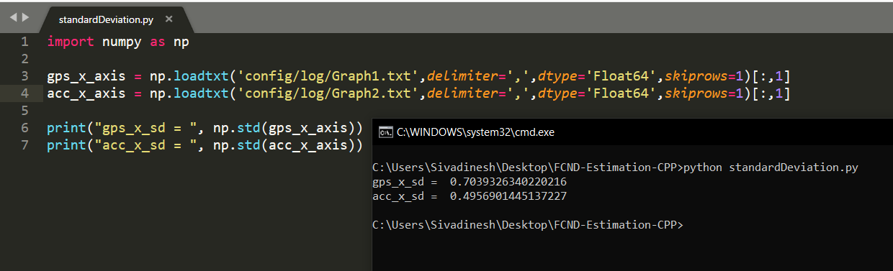
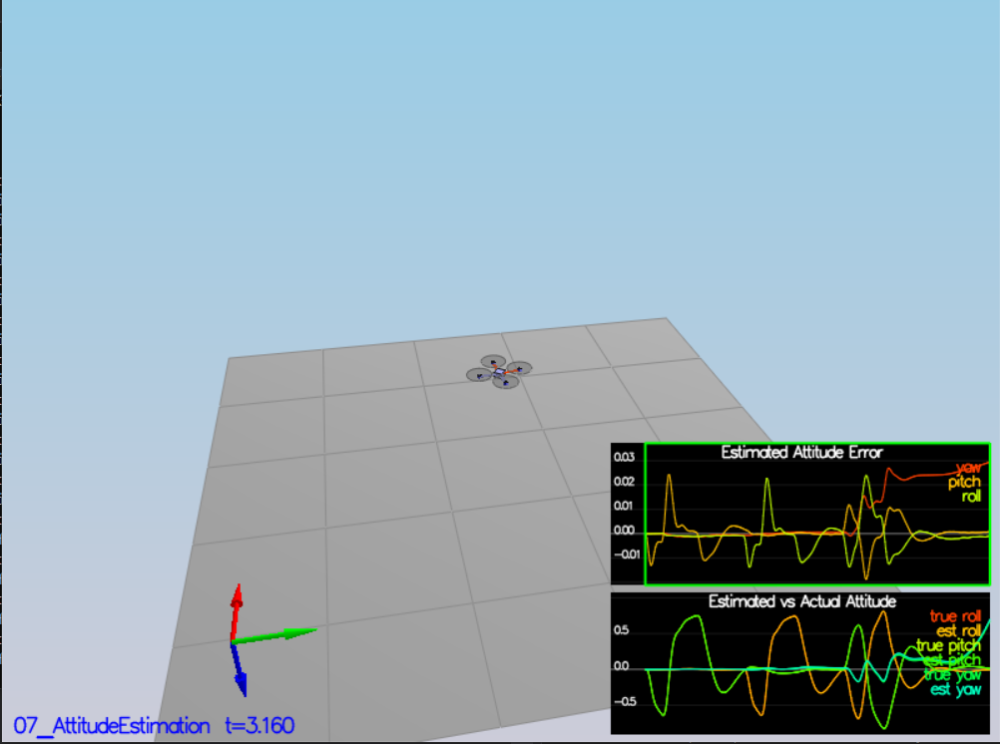

## Project: Building an Estimator

---
### Writeup   

The current writeup.md file that you are reading is my writeup for how i overcame each tasks. 

### Implementing the estimator

#### Task 1: Sensor Noise

Initially I ran the particular scenario and then in order to calculate the standard deviation of x axis in gps from Graph1.txt file and in accelerometer from Graph2.txt. I wrote a python script *standardDeviation.py* which calculates and print the standard deviation using the numpy library. Those values were rounded off to 4 digits after decimal and updated in 06_SensorNoise.txt config file. And thus it passed the Task 1. Basically I parsed the values and appended it as list and then converted it into numpy array. Those numpy.std() calculates standard deviation from array.

---

#### Task 2: Attitude Estimation

* In the QuadEstimatorEKF.cpp file, the angular velocity corresponding to the body frame obtained from the IMU are converted corresponding to the inertial frame using the rotational matrix transformation in the UpdateFromIMU function.
* These values were used to integrate the current roll, pitch and yaw angles for the time duration of dtIMU and then the yaw angle is normalised to lie inbetween -pi and +pi.

Thus passed the Task 2.

---

#### scenario 3: Position Control

The altitude control function is implemented in cpp. Basically it is a PID controller. Basically position error is calculated and integrated to find the I term. The velocity is also calculated. Then the corected Z is determined. Then it is used to calculate the thrust and the orientation of the vehicle. Thus the kpPosXY, kpPosZ, KiPosZ, kpVelXY and kpVelZ values are changed. kpPQR and kpBank values are also altered without affecting the other scenario to get the desired output.

---

#### scenario 4: Nonidealities

The LateralPositionControl function is implemented in cpp. Basically it is a PD controller. The X and Y coordinates are calculated. The position and velocity errors are calculated and optimized below the minimum level. The kpPosXY and the kpVelXY values are altered without affecting the other scenario to get the desired output.

---

#### scenario 5: Trajectory follow

The yawControl function is implemented in cpp. Basically position error of the quad is optimized. Generally yaw handles the Z movement of the quad. Thus the error is optimized and updated. The kpYaw value is altered without affecting the other scenario to get the desired output.
